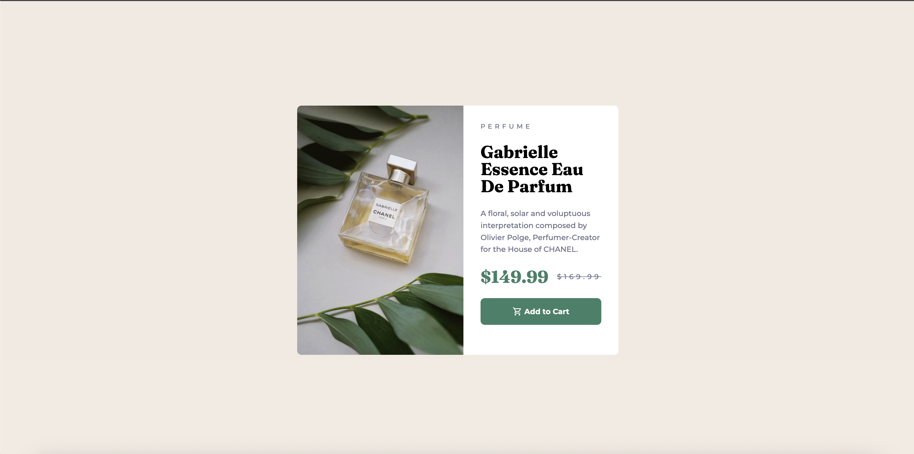

# Frontend Mentor - Product preview card component

A simple solution for the [Frontend Mentor](https://www.frontendmentor.io) challenge - Perfume card.

This project was created to practive HTML & CSS & RWD following the disign in Figma.

---

## Overview

This project recreates a **QR Code card component** from a Figma design, including:

- Centered card layout
- Add card wrapper
- Title and description text
- Mobile-first responsive design
- Smooth scaling for larger screens (desktop)

---

## Links

- Solution URL: [GitHub Repository](https://github.com/przemekkoczwara/perfume-card)
- Live Site URL: [Your Live Site](https://przemekkoczwara.github.io/perfume-card/)

---

## Built With

- HTML5 & Semantic Markup
- CSS Variables & Flexbox
- Mobile-first responsive design

---
